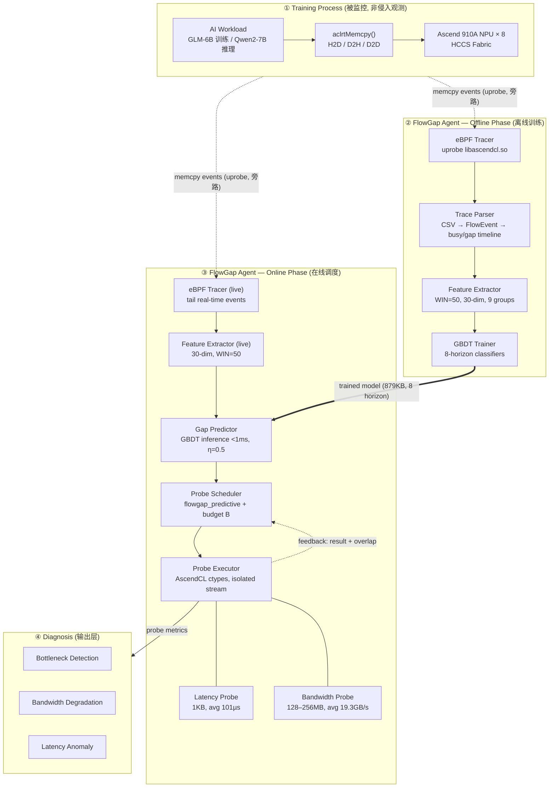

# FlowGap 系统架构图绘制说明

> 本文档详细描述 FlowGap 系统架构，供绘图工具（draw.io / Figma / Excalidraw / Mermaid 等）重新绘制使用。
> 所有模块、数据流、参数均来自 `docs/system_architecture.md` 实测内容，无虚构。

---

## 1. 架构总览（一句话）

FlowGap 由 **1 个被监控对象（Training Process）** + **1 个核心 Agent（含离线/在线两阶段、7 个模块）** + **1 个诊断输出层** 组成。核心数据流是一条 **单向主链路**（采集 → 学习 → 预测 → 探测 → 诊断），外加 **一条离线→在线的模型交付支线** 和 **一条在线→采集的反馈支线**。

绘图时建议的整体布局：**从上到下 4 个泳道（horizontal swimlane）**，或 **从左到右 4 个区块**。推荐"从上到下"，因为数据流有明确的先后阶段。

---

## 2. 四大区块（建议用不同底色的容器框）

| 区块 | 名称 | 建议配色 | 含义 |
|:---:|------|---------|------|
| A | Training Process（被监控对象） | 灰/中性色 | 真实 AI 负载，FlowGap 不修改它，只观测 |
| B | FlowGap Agent — Offline Phase | 蓝色系 | 离线：从历史 trace 学习预测模型 |
| C | FlowGap Agent — Online Phase | 绿色系 | 在线：实时预测安全窗口并执行探针 |
| D | Diagnosis（输出层） | 橙/黄色系 | 消费探针结果，产出健康诊断 |

> 关键设计原则：**B 与 C 同属一个 Agent，但时间上分离**（B 先跑、产出模型；C 用模型在线运行）。绘图时应让 B、C 视觉上同属一个大框（FlowGap Agent），内部再分两个子区。

---

## 3. 各区块内的模块与节点

### 区块 A：Training Process（被监控对象，中性灰）

这是一个**外部系统**，FlowGap 仅通过 eBPF 旁路观测，不侵入。

| 节点 | 标签文字 | 副标题/说明 |
|:---:|---------|------------|
| A1 | Ascend 910A NPU × 8 | /dev/davinci0–7, HCCS Fabric 全互联 |
| A2 | AI Workload | GLM-6B 训练 / Qwen2-7B 推理 |
| A3 | aclrtMemcpy() | H2D / D2H / D2D 传输 |

**A 区内部关系**：A2（workload）运行在 A1（硬件）上，通过 A3（memcpy API）产生传输流量。可画成 A2 → A3 → A1（HCCS）的纵向小链，或合并为一个含 3 行文字的框。

---

### 区块 B：Offline Phase（离线训练，蓝色）

数据流是**严格的 4 级流水线**，从上到下/从左到右单向串联：

| 节点 | 标签 | 副标题 | 关键参数 |
|:---:|------|--------|---------|
| B1 | eBPF Tracer | uprobe on `libascendcl.so` | 采集 aclrtMemcpy 入口/返回；NUMA 感知；CPU 开销中位数 +0.075pp |
| B2 | Trace Parser | CSV → FlowEvent → Timeline | group_by_path；build_timeline 产出 busy/gap 双时间线 |
| B3 | Feature Extractor | 滑动窗口 WIN=50 | 30 维特征，9 组 |
| B4 | GBDT Trainer | 8-horizon 二分类器 | n_estimators=200, depth=4, lr=0.1 |

**B 区内部连线**（单向，实线箭头）：
```
B1 → B2 → B3 → B4
```
连线标签（可选）：B1→B2 标 "raw CSV log"；B2→B3 标 "FlowEvent / timeline"；B3→B4 标 "30-dim samples + labels"。

---

### 区块 C：Online Phase（在线运行，绿色）

同样是流水线，但带一个**反馈回路**：

| 节点 | 标签 | 副标题 | 关键参数 |
|:---:|------|--------|---------|
| C1 | eBPF Tracer (live) | tail 实时事件流 | 与 B1 同一采集器，在线模式 |
| C2 | Feature Extractor (live) | 实时 30 维特征 | 复用 B3 逻辑，WIN=50 |
| C3 | Gap Predictor | GBDT 推理 P(gap ≥ h) | CPU 推理 <1ms；置信度阈值 η=0.5 |
| C4 | Probe Scheduler | flowgap_predictive 策略 | 置信度门控 + budget B 约束 |
| C5 | Probe Executor | AscendCL ctypes | 独立 stream 隔离 |

**C5 内部含两类探针**（可画成 C5 下的两个小节点）：
- C5a：Latency Probe — 1KB buffer, avg 101 µs (24–167 µs)
- C5b：Bandwidth Probe — 128–256 MB buffer, avg 19.3 GB/s (14.4–20.8 GB/s)

**C 区内部连线**（单向实线）：
```
C1 → C2 → C3 → C4 → C5
```
连线标签：C2→C3 标 "30-dim feature vector"；C3→C4 标 "P(safe) per horizon"；C4→C5 标 "probe decision (type + path)"。

**反馈回路**（虚线箭头，区别于主链）：
```
C5 ──(probe result: latency/bw, actual overlap)──▶ C4
```
说明：探针执行结果反馈给 Scheduler，用于调整后续调度（实际窗口是否提前结束等）。

---

### 区块 D：Diagnosis（输出层，橙黄色）

消费 C 区探针的测量结果，产出三类健康判断：

| 节点 | 标签 | 说明 |
|:---:|------|------|
| D1 | Bottleneck Detection | 综合判断链路瓶颈 |
| D2 | Bandwidth Degradation | 带宽下降告警（如 P0.4: 20.1 → 10.77 GB/s） |
| D3 | Latency Anomaly | 延迟异常告警 |

D1/D2/D3 可并列为 3 个小框，统一接收来自 C5 的 metrics。

---

## 4. 跨区块的关键连线（这是原图逻辑混乱的根源，务必画清楚）

绘图时**只有三类跨区箭头**，建议用不同线型区分：

### 连线 1：观测流（A → B 和 A → C），点划线/灰色
- `A (Training Process) ──memcpy events (uprobe)──▶ B1 (eBPF Tracer)`
- `A (Training Process) ──memcpy events (uprobe)──▶ C1 (eBPF Tracer live)`
- 含义：FlowGap 通过 eBPF 旁路**观测**训练流量，**不干扰**（这是卖点）。建议用灰色虚线，强调"非侵入旁路"。

### 连线 2：模型交付（B → C），粗实线/高亮色
- `B4 (GBDT Trainer) ──trained model (gbdt_pass1.pkl, 879KB, 8 horizon)──▶ C3 (Gap Predictor)`
- 含义：离线训练好的模型加载到在线预测器。**这是连接两个阶段的唯一桥梁**，应当醒目（如加粗的蓝色实线 + "model" 标签）。

### 连线 3：诊断输出（C → D），实线
- `C5 (Probe Executor) ──probe metrics (latency / bandwidth)──▶ D (Diagnosis)`
- 含义：探针测量结果送入诊断层。

> **重要：A 区流量与 C5 探针都流向 HCCS Fabric，但二者用独立 stream 隔离。** 如果想表达"探针也走 HCCS"，可画一条从 C5 回到 A1(HCCS) 的细线并标注 "isolated AscendCL stream"，但这容易让图变乱，建议放在图注（caption）里说明，不画线。

---

## 5. 推荐布局方案（从上到下 4 行泳道）

```
┌────────────────────────────────────────────────────────────────────┐
│ 行1  区块 A: Training Process                                       │
│      [Ascend 910A NPU×8] — [AI Workload GLM-6B/Qwen2-7B] — [aclrtMemcpy]│
└───────────────┬──────────────────────────────┬─────────────────────┘
                │ memcpy events (灰虚线,旁路)    │ memcpy events (旁路)
                ▼                               ▼
┌──────────────────────────────┐  ┌──────────────────────────────────┐
│ 行2  区块 B: Offline Phase    │  │ 行3  区块 C: Online Phase         │
│  B1 eBPF Tracer               │  │  C1 eBPF Tracer (live)            │
│      ↓                        │  │      ↓                            │
│  B2 Trace Parser              │  │  C2 Feature Extractor (live)      │
│      ↓                        │  │      ↓                            │
│  B3 Feature Extractor         │  │  C3 Gap Predictor ◀───────────────┼── model
│      ↓                        │  │      ↓               (粗蓝实线)    │
│  B4 GBDT Trainer ─────model───┼─▶│  C4 Probe Scheduler               │
│                               │  │      ↓        ▲                    │
│                               │  │      │        │ feedback(虚线)     │
│                               │  │  C5 Probe Executor                │
│                               │  │    ├ Latency Probe (101µs)        │
│                               │  │    └ Bandwidth Probe (19.3GB/s)   │
└──────────────────────────────┘  └──────────────────┬────────────────┘
                                                     │ metrics
                                                     ▼
                          ┌────────────────────────────────────────────┐
                          │ 行4  区块 D: Diagnosis                       │
                          │  [Bottleneck] [BW Degradation] [Latency Anom]│
                          └────────────────────────────────────────────┘
```

> 注：上面是 B、C 并排（左右）的方案。若 12 页论文版面是单栏窄图，可改为 B 在上、C 在下的纵向串联，把"model"箭头从 B4 垂直引到 C3。

---

## 6. Mermaid 版本（可直接渲染，作为绘图参考底稿）



---

## 7. 绘图要点 checklist（避免重蹈原图混乱）

- [ ] **B 和 C 视觉上同属一个大框（FlowGap Agent）**，但内部明确分"离线/在线"两个子区
- [ ] **三类跨区箭头用三种线型**：旁路观测（灰虚线）、模型交付（粗实线高亮）、诊断输出（普通实线）
- [ ] **模型交付箭头（B4→C3）是全图最重要的连接**，必须醒目
- [ ] **反馈回路（C5→C4）用虚线**，与主流水线（实线）区分
- [ ] eBPF Tracer 在 B 和 C 各出现一次（同一采集器，离线/在线两种模式），可在图注说明"复用同一采集器"
- [ ] Feature Extractor 同理（B3 与 C2 复用同一逻辑）
- [ ] 避免原图那种"箭头横跨多个区块、交叉缠绕"的画法——所有连线尽量正交（横平竖直）、不交叉
- [ ] 关键量化参数（101µs / 19.3GB/s / <1ms / +0.075pp）作为节点副标题，体现真实性
- [ ] **不要画"探针流量回 HCCS"的线**（容易乱），改在 caption 说明"探针经独立 stream 与训练隔离"

---

## 8. 建议的图注（caption）

> **Figure 4. FlowGap system architecture.** FlowGap observes an unmodified AI training/inference workload on an 8-NPU Ascend 910A server through eBPF uprobes on `aclrtMemcpy` (dashed gray, non-intrusive). In the offline phase, collected traces are parsed into per-path busy/gap timelines, transformed into 30-dimensional features over a sliding window (WIN=50), and used to train eight per-horizon GBDT classifiers. The trained model (bold arrow) is loaded by the online Gap Predictor, which estimates the safe-window probability P(gap ≥ h) in under 1 ms. A confidence-gated scheduler then dispatches latency or bandwidth probes through an isolated AscendCL stream, and probe results feed both a diagnosis layer and a scheduler feedback loop.
