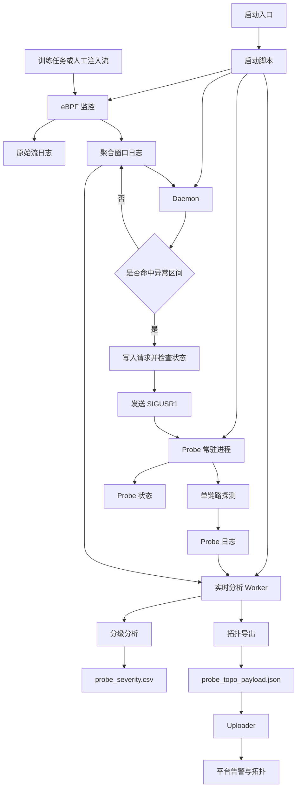

# HostDiagV2

## 项目概览
- `hostdiagv2` 是一套围绕 Ascend 910A/B 大模型流量的主机内链路诊断工程。
- 它把被动监控、异常触发、主动探测、实时分级、平台上报串成一条完整链路。

## 主链路
1. `eBPF` 监控 `aclrtMemcpy`
2. 按固定方向做业务时间窗聚合
3. `daemon` 发现异常吞吐区间后触发单链路 `probe`
4. `probe` 只对命中链路做 `Bandwidth -> Latency` 探测
5. 实时分析脚本输出 `probe_severity.csv`
6. 导出 uploader 所需拓扑 payload，供平台上报

## 项目流程图



## 流程说明
- `start_monitor_stack.sh` 是总入口，会同时拉起 `eBPF`、`probe`、`daemon` 和实时分析 worker。
- `trace_memcpy_numa.py` 负责被动监控训练背景流或人工注入流产生的 `aclrtMemcpy`。
- `npu_adaptive_daemon.cpp` 只读取聚合窗口，不直接分析 `probe.log`。
- `memcpy_benchmark` 只对被命中的单条链路做主动探测，不再跑全矩阵。
- `probe_analysis_worker.py` 只负责“发现新数据就触发分析”，核心分级逻辑在 `probe_severity_analyzer.py`。
- `export_uploader_topo.py` 负责把内部的链路分级结果映射成 uploader 平台需要的固定拓扑 JSON。

## 目录整理

```text
/root/hostdiagv2
├── README.md
├── start_monitor_stack.sh
├── stop_monitor_stack.sh
├── src/
│   ├── trace_memcpy_numa.py
│   ├── npu_adaptive_daemon.cpp
│   ├── probe_severity_analyzer.py
│   ├── probe_analysis_worker.py
│   └── export_uploader_topo.py
├── scripts/
│   ├── start_monitor_stack.sh
│   ├── stop_monitor_stack.sh
│   └── run_benchmark.sh
├── probe/
│   ├── CMakeLists.txt
│   ├── README.md
│   ├── build.sh
│   ├── build/
│   │   └── memcpy_benchmark
│   └── src/
│       └── memcpy_benchmark.cpp
├── bin/
│   └── npu_adaptive_daemon
├── logs/
│   └── runtime/
│       ├── probe.log
│       ├── ebpf.log
│       ├── daemon.log
│       ├── analyzer.log
│       ├── probe.pid
│       ├── ebpf.pid
│       ├── daemon.pid
│       ├── analyzer.pid
│       ├── probe.status
│       └── probe_request.csv
├── runs/
│   ├── raw/
│   │   └── aclrtMemcpy_numa_raw.log
│   ├── agg/
│   │   ├── aclrtMemcpy_numa_trace.log
│   │   ├── aclrtMemcpy_numa_trace.log.agg
│   │   └── probe_trigger_windows.csv
│   └── severity/
│       ├── probe_severity.csv
│       └── probe_topo_payload.json
├── docs/
│   ├── monitor_probe_联动与排障手册.md
│   ├── test_methods_summary.md
│   └── paper.pdf
├── archive/
│   ├── benchmark.log
│   ├── cpp_benchmark_resource.csv
│   ├── monitor_resource.py
│   ├── plot_resource.py
│   ├── trace_output.log
│   └── trace_resource.csv
└── __pycache__/
```

## 各目录用途

### `src`
- 当前主链路源码目录。
- `trace_memcpy_numa.py`
  - eBPF 监控脚本。
  - 负责 hook `aclrtSetDevice` 和 `aclrtMemcpy`。
  - 输出原始日志和业务时间窗聚合日志。
- `npu_adaptive_daemon.cpp`
  - 读取聚合结果。
  - 根据异常窗口构造 `probe_request.csv`。
  - 检测 `probe.status`，空闲时才发送 `SIGUSR1`。
- `probe_severity_analyzer.py`
  - 从 `probe.log` 和聚合窗口中生成 `probe_severity.csv`。
  - 计算 `probe` 所在业务窗、合并后吞吐、固定基线对比和 `P0/P1/P2`。
- `probe_analysis_worker.py`
  - 实时轮询 `probe.log` 和 `runs/agg/aclrtMemcpy_numa_trace.log`。
  - 文件有变化就自动刷新 `probe_severity.csv` 和 uploader payload。
- `export_uploader_topo.py`
  - 将 `probe_severity.csv` 映射成平台要求的拓扑 JSON。

### `scripts`
- 实际执行入口。
- `start_monitor_stack.sh`
  - 一键启动 `probe + eBPF + daemon + analyzer`
  - 自动重编 `daemon`
  - 自动启动实时分析 worker
- `stop_monitor_stack.sh`
  - 一键停止上述进程
- `run_benchmark.sh`
  - 历史实验脚本，默认不参与主链路

### `probe`
- 单链路主动探测子工程。
- `src/memcpy_benchmark.cpp`
  - 常驻等待 `SIGUSR1`
  - 只对 daemon 指定链路做 `Bandwidth -> Latency`
  - 不做 `8x8`、不做双向、不做 warmup
- `build.sh`
  - 无 `cmake` 环境时的快速构建脚本
- `build/memcpy_benchmark`
  - 当前 probe 可执行文件

### `bin`
- 编译产物目录。
- 当前主要保存 `npu_adaptive_daemon`。

### `logs/runtime`
- 当前运行期日志与状态文件。
- `probe.log`
  - 单链路 probe 输出
- `ebpf.log`
  - eBPF 脚本控制台输出
- `daemon.log`
  - 异常判定、状态判断、信号触发日志
- `analyzer.log`
  - 实时分析 worker 日志
- `probe.status`
  - `idle` / `busy`
- `probe_request.csv`
  - daemon 写给 probe 的单链路请求
- `*.pid`
  - 各进程 pid 文件

### `runs/raw`
- 原始逐调用日志。
- `aclrtMemcpy_numa_raw.log`
  - 每次 `aclrtMemcpy` 一行
  - 包含源/目的、大小、时延、带宽、开始/结束时刻和 wall time

### `runs/agg`
- 业务窗口聚合结果。
- `aclrtMemcpy_numa_trace.log`
  - daemon 主输入
  - 按 `src -> dst` 固定方向聚合
- `probe_trigger_windows.csv`
  - 记录 daemon 的触发元数据
- `aclrtMemcpy_numa_trace.log.agg`
  - 历史保留文件

### `runs/severity`
- 实时分析与上传导出目录。
- `probe_severity.csv`
  - 每个 loop 的分级结果
  - 包括 `probe` 起止、命中业务窗起止、吞吐比例、原因
- `probe_topo_payload.json`
  - 按 uploader 平台 schema 导出的拓扑 payload

### `docs`
- 说明文档、方法总结和参考资料。

### `archive`
- 历史实验与归档文件。
- 默认不参与当前在线链路。

## 根目录入口
- [start_monitor_stack.sh](file:///root/hostdiagv2/start_monitor_stack.sh)
- [stop_monitor_stack.sh](file:///root/hostdiagv2/stop_monitor_stack.sh)

- 这两个入口只是转发器。
- 实际会调用：
  - [scripts/start_monitor_stack.sh](file:///root/hostdiagv2/scripts/start_monitor_stack.sh)
  - [scripts/stop_monitor_stack.sh](file:///root/hostdiagv2/scripts/stop_monitor_stack.sh)

## 运行流程
1. 背景训练流持续产生 `aclrtMemcpy`
2. [trace_memcpy_numa.py](file:///root/hostdiagv2/src/trace_memcpy_numa.py) 采集原始流并聚合时间窗
3. [npu_adaptive_daemon.cpp](file:///root/hostdiagv2/src/npu_adaptive_daemon.cpp) 读取聚合日志并决定是否触发
4. [memcpy_benchmark.cpp](file:///root/hostdiagv2/probe/src/memcpy_benchmark.cpp) 对目标链路执行单链路探测
5. [probe_analysis_worker.py](file:///root/hostdiagv2/src/probe_analysis_worker.py) 实时生成分级结果与上报 payload
6. `/root/uploader/upload_topo.py` 读取 payload 并上传平台

## 快速开始

### 一键启动
```bash
bash /root/hostdiagv2/start_monitor_stack.sh
```

### 一键停止
```bash
bash /root/hostdiagv2/stop_monitor_stack.sh
```

### 常用启动参数
```bash
MIN_SIZE=1048576 \
WINDOW_MS=100 \
LOW_MBPS=800 \
HIGH_MBPS=26000 \
COOLDOWN_SEC=3 \
PYTHON_BIN=/usr/bin/python3 \
bash /root/hostdiagv2/start_monitor_stack.sh
```

## 常用环境变量
- `MIN_SIZE`
  - 监控最小 memcpy 大小，单位 Byte
- `WINDOW_MS`
  - 兼容参数，传给监控脚本
- `LOW_MBPS` / `HIGH_MBPS`
  - daemon 触发异常区间，单位 MB/s
- `COOLDOWN_SEC`
  - 两次触发之间的最小间隔
- `PROBE_BIN`
  - 手动指定 probe 二进制
- `PROBE_REQUIRED`
  - 设为 `1` 时，找不到 probe 直接失败
- `PROBE_STATUS_FILE`
  - 自定义 `probe.status` 路径
- `PROBE_REQUEST_FILE`
  - 自定义 `probe_request.csv` 路径
- `PROBE_SEVERITY_CSV`
  - 自定义分级输出路径
- `PROBE_TOPO_PAYLOAD`
  - 自定义 uploader payload 输出路径
- `UPLOADER_SCRIPT`
  - 默认 `/root/uploader/upload_topo.py`

## 实时分析 + Uploader 上传

### 实时分析链路
- 启动脚本会自动启动 [probe_analysis_worker.py](file:///root/hostdiagv2/src/probe_analysis_worker.py)。
- 它持续监听：
  - `/root/hostdiagv2/logs/runtime/probe.log`
  - `/root/hostdiagv2/runs/agg/aclrtMemcpy_numa_trace.log`
- 一旦这些文件变化，就自动刷新：
  - `/root/hostdiagv2/runs/severity/probe_severity.csv`
  - `/root/hostdiagv2/runs/severity/probe_topo_payload.json`

### 实时查看分析结果
```bash
tail -f /root/hostdiagv2/logs/runtime/analyzer.log
```

```bash
column -s, -t /root/hostdiagv2/runs/severity/probe_severity.csv | head -n 20
```

### 直接导出 uploader payload
```bash
python3 /root/hostdiagv2/src/export_uploader_topo.py \
  --severity-input /root/hostdiagv2/runs/severity/probe_severity.csv \
  --output /root/hostdiagv2/runs/severity/probe_topo_payload.json
```

### 上传平台
- [upload_topo.py](file:///root/uploader/upload_topo.py) 已改成默认优先读取：
  - `/root/hostdiagv2/runs/severity/probe_topo_payload.json`
- 直接执行即可上传当前实时结果：

```bash
python3 /root/uploader/upload_topo.py
```

- 如果你想忽略实时 payload，强制使用 uploader 自己的静态示例拓扑：

```bash
python3 /root/uploader/upload_topo.py --ignore-runtime-payload
```

## Probe 子工程构建

### `cmake`
```bash
cd /root/hostdiagv2/probe
cmake -S . -B build
cmake --build build -j
```

### `build.sh`
```bash
bash /root/hostdiagv2/probe/build.sh
```

### 依赖提醒
- 需要 Ascend Toolkit 头文件和动态库
- 需要 `libnuma-dev`
- 如果缺 `numa.h`，先执行：

```bash
apt-get update && apt-get install -y libnuma-dev
```

## 常用排查命令

### 看原始 memcpy
```bash
tail -f /root/hostdiagv2/runs/raw/aclrtMemcpy_numa_raw.log
```

### 看业务聚合窗口
```bash
tail -f /root/hostdiagv2/runs/agg/aclrtMemcpy_numa_trace.log
```

### 看 daemon
```bash
tail -f /root/hostdiagv2/logs/runtime/daemon.log
```

### 看 probe
```bash
tail -f /root/hostdiagv2/logs/runtime/probe.log
```

### 看实时分级
```bash
tail -f /root/hostdiagv2/runs/severity/probe_severity.csv
```

### 看上传 payload
```bash
cat /root/hostdiagv2/runs/severity/probe_topo_payload.json
```

## 已知注意事项
- eBPF 需要足够权限，否则 `ebpf.log` 会报 BPF 权限或编译错误
- 背景训练流存在空窗期，raw/agg 短时间不增长不一定是故障
- `SIGUSR1` 不是实时队列信号，但当前 daemon 已加入 `busy/idle` 检查
- `probe_severity.csv` 的基线使用 `200 Gbps = 25 GB/s`
- uploader 平台拓扑与内部 `NUMA/NPU` 链路不是一一同名，导出脚本会做映射
